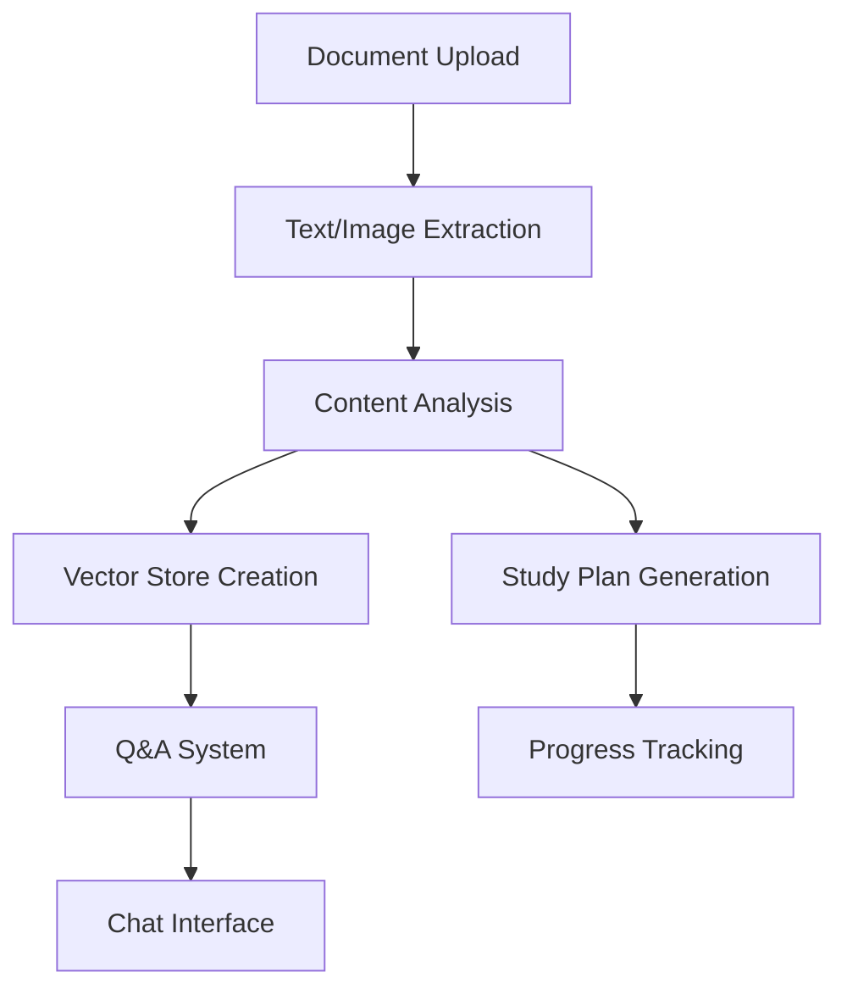

# 🧠 PrepWise-AI

<div align="center">


**An intelligent document analysis and study assistant powered by Google Gemini AI**

[](https://www.python.org/)
[](https://flask.palletsprojects.com/)
[](https://ai.google.dev/)
[](LICENSE)

[Features](#-features) • [Installation](#-installation) • [Usage](#-usage) • [Demo](#-demo) • [Contributing](#-contributing)

</div>

---

## 🎯 Overview

PrepWise-AI is a cutting-edge study assistant that transforms your documents into interactive learning experiences. Upload your study materials, get AI-generated study plans, and chat with your documents using advanced natural language processing.

### Main Interface

*Upload documents, process them, and interact with your personalized study plan*

### Chat Interface


*Ask questions about your documents and get intelligent, contextual responses*

### 🌟 What Makes PrepWise-AI Special?

- **Multi-Format Support**: Process PDFs, Word docs, Excel files, PowerPoint presentations, and images
- **AI-Powered Analysis**: Leverages Google Gemini AI for intelligent document understanding
- **Smart Study Plans**: Automatically generates structured study checklists from your content
- **Interactive Chat**: Ask questions about your documents in natural language
- **Progress Tracking**: Keep track of your study progress with interactive checklists
- **Multiple Answer Styles**: Get responses tailored to your learning needs

## ✨ Features

### 📄 Document Processing
- **Multi-format Upload**: PDF, DOCX, XLSX, PPTX, JPG, PNG support
- **Text Extraction**: Advanced text extraction from all supported formats
- **Image Analysis**: AI-powered image content analysis and description
- **Vector Storage**: Efficient document indexing using FAISS for fast retrieval

### 🎓 Smart Study Tools
- **Auto Study Plans**: AI generates structured study checklists from your documents
- **Progress Tracking**: Visual progress bars and completion tracking
- **Interactive Checklists**: Check off completed topics and track your learning journey

### 💬 Intelligent Chat Interface
- **Natural Language Queries**: Ask questions about your documents conversationally
- **Multiple Response Styles**:
  - **Explanatory**: Detailed explanations with examples
  - **Concise**: Brief, to-the-point answers
  - **Cheat Sheet**: Key points and summaries
  - **Exam-Ready**: Comprehensive answers formatted for exam preparation

### 🚀 Modern Web Interface
- **Responsive Design**: Works seamlessly on desktop and mobile devices
- **Real-time Processing**: Live progress updates during document analysis
- **Export Functionality**: Export chat histories in Markdown, HTML, or plain text
- **Intuitive UI**: Clean, modern interface inspired by Google Material Design

## 🔧 Installation

### Prerequisites
- Python 3.8 or higher
- Google AI API key (Gemini)

### Quick Start

1. **Clone the repository**
   ```bash
   git clone https://github.com/yourusername/PrepWise-AI.git
   cd PrepWise-AI
   ```

2. **Create a virtual environment**
   ```bash
   python -m venv venv
   source venv/bin/activate  # On Windows: venv\Scripts\activate
   ```

3. **Install dependencies**
   ```bash
   pip install -r requirements.txt
   ```

4. **Set up environment variables**
   ```bash
   # Create .env file in the project root
   echo "GOOGLE_API_KEY=your_google_api_key_here" > .env
   ```

5. **Run the application**
   ```bash
   python main.py
   ```

6. **Open your browser**
   Navigate to `http://localhost:5000` and start learning!

### 🔑 Getting a Google AI API Key

1. Visit the [Google AI Studio](https://makersuite.google.com/app/apikey)
2. Create a new project or select an existing one
3. Generate an API key for Gemini AI
4. Add the key to your `.env` file


## Key Workflow

1. **📚 Upload Documents**: Drag and drop or browse files (PDF, Word, Excel, PowerPoint, Images)
2. **🔄 Process Files**: AI analyzes content and extracts text/images
3. **📋 Study Plan**: Automatically generated checklist based on document structure
4. **💭 Chat & Learn**: Ask questions and get answers in your preferred style
5. **📊 Track Progress**: Mark completed topics and monitor your learning journey

## 🛠️ Technical Architecture

### Backend Components
- **Flask Web Framework**: Lightweight and flexible web server
- **Google Gemini AI**: Advanced language model for text analysis and generation
- **PyPDF2 & PyMuPDF**: PDF text and image extraction
- **LangChain**: Document chunking and vector operations
- **FAISS**: Efficient similarity search and document retrieval
- **Multiple File Parsers**: Support for various document formats

### Frontend Features
- **Vanilla JavaScript**: No heavy frameworks, pure performance
- **Responsive CSS**: Modern, mobile-first design
- **Real-time Updates**: WebSocket-like polling for progress tracking
- **File Drag & Drop**: Intuitive file upload experience

### Data Flow


## 📁 Project Structure

```
PrepWise-AI/
├── main.py                 # Flask application and API routes
├── requirements.txt        # Python dependencies
├── .env                   # Environment variables (create this)
├── static/
│   ├── css/
│   │   └── style.css      # Modern, responsive styling
│   └── js/
│       └── script.js      # Frontend interactivity
├── templates/
│   └── index.html         # Main application interface
├── uploads/               # Temporary file storage (auto-created)
├── vector_stores/         # Document embeddings (auto-created)
└── README.md             # You are here!
```

## 🎨 Customization

### Adding New File Types
Extend the `allowed_file()` function and add corresponding extraction logic:

```python
def extract_text_from_new_format(file_path):
    # Your extraction logic here
    return extracted_text
```

### Custom Answer Styles
Add new response templates in the `prompt_templates` dictionary:

```python
prompt_templates["Custom Style"] = """
    Your custom prompt template here...
    Context: {context}
    Question: {question}
"""
```

### UI Themes
Modify CSS variables in `style.css` to customize the appearance:

```css
:root {
    --primary-color: #your-color;
    --secondary-color: #your-secondary-color;
    /* ... */
}
```

## 🔒 Security Considerations

- Files are processed locally and stored temporarily
- Vector embeddings are session-specific
- API keys are environment-protected
- No persistent storage of uploaded documents
- Session-based file isolation

## 🐛 Troubleshooting

### Common Issues

**API Key Errors**
```bash
Error: GOOGLE_API_KEY not found in environment variables.
```
- Ensure your `.env` file contains a valid Google AI API key
- Restart the application after adding the key

**File Upload Failures**
- Check file size limits (16MB default)
- Verify file format is supported
- Ensure sufficient disk space

**Processing Stuck**
- Check console logs for detailed error messages
- Verify internet connection for AI API calls
- Try with smaller documents first

### Debug Mode
Run with debug enabled for detailed error information:
```bash
export FLASK_DEBUG=1
python main.py
```

## 🤝 Contributing

We welcome contributions! Here's how you can help:

1. **Fork the repository**
2. **Create a feature branch**: `git checkout -b feature/amazing-feature`
3. **Commit your changes**: `git commit -m 'Add amazing feature'`
4. **Push to the branch**: `git push origin feature/amazing-feature`
5. **Open a Pull Request**

### Development Setup

```bash
# Install development dependencies
pip install -r requirements-dev.txt

# Run tests
python -m pytest

# Check code style
flake8 main.py
```

### Areas for Contribution
- [ ] Additional file format support
- [ ] Enhanced UI/UX improvements
- [ ] Mobile app development
- [ ] Advanced analytics and insights
- [ ] Multi-language support
- [ ] Collaborative study features

## 📄 License

This project is licensed under the GPL-3.0 license - see the [LICENSE](LICENSE) file for details.

## 🙏 Acknowledgments

- **Google AI** for the powerful Gemini language model
- **LangChain** for document processing utilities
- **FAISS** for efficient vector similarity search
- **Flask** community for the excellent web framework
- **Open Source Community** for inspiration and tools

---

<div align="center">

**Made with ❤️ for students and learners everywhere**

[⭐ Star this repo](https://github.com/yourusername/PrepWise-AI) • [🐛 Report Bug](https://github.com/yourusername/PrepWise-AI/issues) • [💡 Request Feature](https://github.com/yourusername/PrepWise-AI/issues)

</div>